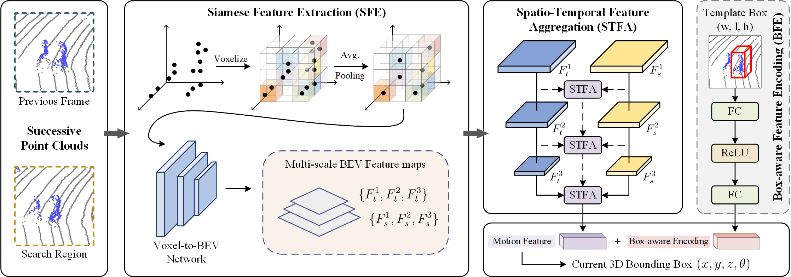

# SiamMo
This repo is the official implementation of "SiamMo: Siamese Motion-Centric 3D Object Tracking". It currently includes the testing code and models for 3D single object tracking.
An open source platform for general 3D single object tracking, based on [OpenMMlab](https://github.com/open-mmlab/mmdetection3d).

### Features
+ Modular design. It is easy to config the model and training/testing behaviors through just a `.py` file.
+ DDP support for both training and testing.
+ Support all common tracking datasets (KITTI, NuScenes, Waymo Open Dataset).

### Introduction
Existing methods for 3D single object tracking predominantly follow the Siamese matching-based paradigm, which has long suffered from issues with textureless and incomplete LiDAR point clouds. On the other hand, the motion-centric paradigm eliminates the need of the appearance matching, largely overcoming these issues. However, its antiquated performance and multi-stage process hinder further research, while the potential remains under-explored. In this paper, we present a novel and simple Siamese motion-centric tracking approach, dubbed SiamMo. We innovatively introduce Siamese feature extraction for the motion-centric tracking, instead of the traditional single-stream architecture. It can make feature extraction and temporal fusion decoupled, effectively enhancing the tracking performance. Besides, we design a Spatio-Temporal Feature Aggregation module that integrates the Siamese features at multiple scales to capture the motion information. A Box-aware Feature Encoding module is also introduced to encode object size priors into the motion estimation. Notably, SiamMo is a pure motion-centric tracker that gets rid of extra processes, i.e., segmentation, and box refinement. Without whistles and bells, SiamMo not only significantly surpasses state-of-the-art methods on multiple benchmarks, but also exhibits excellent robustness in challenging settings. For example, SiamMo pushes the current best KITTI tracking result to a new record with 90.1% precision, while maintaining a high inference speed of 108 FPS.



## Main Results on SOT Benchmarks with Pretrained Models
### KITTI
| Category | Success | Precision | Config |  Checkpoint |
| :---: | :---: | :---: | :---: |  :---: |
| Car | 76.25 | 88.05 | [config](configs/kitti/car.py) | [baidu](https://pan.baidu.com/s/1REno9obnDSHzEsHbVvRkZQ?pwd=1234)|
| Pedestrian | 68.59 | 93.85 | [config](configs/kitti/ped.py) | [baidu](https://pan.baidu.com/s/1h53EFurWFyyGUlw5CM7lCg?pwd=1234)|
| Van | 67.86 | 80.45 | [config](configs/kitti/van.py) | [baidu](https://pan.baidu.com/s/1ePR4jerQzM85AMCyreqFXg?pwd=1234)|
| Cyclist | 78.53 | 94.81 | [config](configs/kitti/cyc.py) | [baidu](https://pan.baidu.com/s/1m7CWC56djJCvnX-Wt8xEMQ?pwd=1234)|

### NuScenes
| Category | Success | Precision | Config |  Checkpoint |
| :---: | :---: | :---: | :---: |  :---: |
| Car | 64.95 | 72.24 | [config](configs/nuscenes/car.py) | [baidu](https://pan.baidu.com/s/1u5i4SccW_f-8ChGK5UrooQ?pwd=1234)|
| Pedestrian | 46.23 | 76.25 | [config](configs/nuscenes/ped.py) | [baidu](https://pan.baidu.com/s/12H115vjJKEtwH8geNFlB9g?pwd=1234)|
| Truck | 68.22 | 68.81 | [config](configs/nuscenes/truck.py) | [baidu](https://pan.baidu.com/s/1zdlDCm2tn8_lZ3ZHfClYjg?pwd=1234)|
| Trailer | 73.65 | 71.23 | [config](configs/nuscenes/trailer.py) | [baidu](https://pan.baidu.com/s/11mt9IPpngAgRiveChdN2cg?pwd=1234)|
| Bus | 66.01 | 61.07 | [config](configs/nuscenes/bus.py) | [baidu](https://pan.baidu.com/s/1VIpbk-xlyApT6eB2NeS9ag?pwd=1234)|


## Setup
Here we list the most important part of our dependencies
|Dependency|Version|
|---|---|
|python|3.9.0|
|pytorch|2.0.1 (cuda11.8)|
|mmegine|0.7.4|
|mmcv|2.0.0|
|mmdet|3.0.0|
|mmdet3d|1.1.0| 
|spconv|2.3.6 (cuda11.8)|

### KITTI dataset
+ Download the data for [velodyne](http://www.cvlibs.net/download.php?file=data_tracking_velodyne.zip), [calib](http://www.cvlibs.net/download.php?file=data_tracking_calib.zip) and [label_02](http://www.cvlibs.net/download.php?file=data_tracking_label_2.zip) from [KITTI Tracking](http://www.cvlibs.net/datasets/kitti/eval_tracking.php).
+ Unzip the downloaded files.
+ Put the unzipped files under the same folder as following.
  ```
  [Parent Folder]
  --> [calib]
      --> {0000-0020}.txt
  --> [label_02]
      --> {0000-0020}.txt
  --> [velodyne]
      --> [0000-0020] folders with velodynes .bin files
  ```

### NuScenes dataset
+ Download the dataset from the [download page](https://www.nuscenes.org/download)
+ Extract the downloaded files and make sure you have the following structure:
  ```
  [Parent Folder]
    samples	-	Sensor data for keyframes.
    sweeps	-	Sensor data for intermediate frames.
    maps	        -	Folder for all map files: rasterized .png images and vectorized .json files.
    v1.0-*	-	JSON tables that include all the meta data and annotations. Each split (trainval, test, mini) is provided in a separate folder.
  ```
>Note: We use the **train_track** split to train our model and test it with the **val** split. Both splits are officially provided by NuScenes. During testing, we ignore the sequences where there is no point in the first given bbox.

### Waymo Open Dataset

* We follow the benchmark created by [LiDAR-SOT](https://github.com/TuSimple/LiDAR_SOT) based on the waymo open dataset. You can download and process the waymo dataset as guided by [LiDAR_SOT](https://github.com/TuSimple/LiDAR_SOT), and use our code to test model performance on this benchmark.
* The following processing results are necessary
```
[waymo_sot]
    [benchmark]
        [validation]
            [vehicle]
                bench_list.json
                easy.json
                medium.json
                hard.json
            [pedestrian]
                bench_list.json
                easy.json
                medium.json
                hard.json
    [pc]
        [raw_pc]
            Here are some segment.npz files containing raw point cloud data
    [gt_info]
        Here are some segment.npz files containing tracklet and bbox data 
```

## Quick Start
### Training
To train a model, you must specify the `.py` config file. The `.py` file contains all the configurations of the dataset and the model. We provide `.py` config files under the [*configs*](./configs) directory. **Note:** Before running the code, you will need to edit the `.py` config file by setting the `path` argument as the correct root of the dataset. (We will release the training code upon paper acceptance.)
```bash
# single-gpu training
python train.py $config_file
# multi-gpu training
./dist_train.sh $config_file $num_gpus 
```

### Testing

To test a trained model, specify the checkpoint, and the `.py` config file. We provide the trained model in the Baidu and OneDrive Netdisk. The `.py` file contains all the configurations of the dataset and the model. We provide `.py` config files under the [*configs*](./configs) directory. **Note:** Before running the code, you will need to edit the `.py` config file by setting the `path` argument as the correct root of the dataset.
```bash
# single-gpu testing
python test.py $config_file $checkpoint_file
# multi-gpu testing
./dist_test.sh $config_file $checkpoint_file $num_gpus 
```

## Acknowledgement
This repo is heavily built upon [Open3DSOT](https://github.com/Ghostish/Open3DSOT) and [MMDetection3D](https://github.com/open-mmlab/mmdetection3d).

## License
This repository is released under MIT License (see LICENSE file for details).
